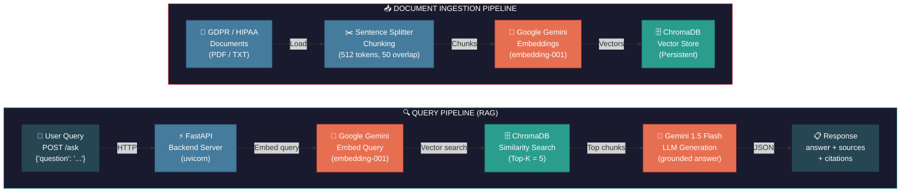

---

## Tech Stack

| Component | Technology | Purpose |
|-----------|-----------|---------|
| 🐍 Backend | **FastAPI** + uvicorn | REST API server |
| 🧠 Embeddings | **Google Gemini** (embedding-001) | Convert text → vectors |
| 🤖 LLM | **Gemini 1.5 Flash** (free tier) | Generate grounded answers |
| 🗄️ Vector DB | **ChromaDB** (persistent) | Store & search embeddings |
| 📚 Framework | **LlamaIndex** | RAG orchestration |
| 📄 Documents | **GDPR regulation text** | Knowledge base |

---

## How It Works

### Ingestion (one-time setup)
```
scripts/ingest.py
```
1. Load GDPR documents from `data/` folder
2. Split into 512-token chunks with 50-token overlap
3. Generate vector embeddings via Gemini API
4. Store vectors in ChromaDB (persistent on disk)

### Query (runtime)
```
POST http://localhost:8000/ask
{"question": "What are the data breach notification rules?"}
```
1. User sends a natural language question
2. FastAPI receives the request
3. Question is embedded using the same Gemini model
4. ChromaDB finds the 5 most similar regulation chunks
5. Chunks + question are sent to Gemini 1.5 Flash LLM
6. LLM generates a grounded answer with article citations
7. Response returned as JSON with answer + source chunks

---

## API Endpoints

| Method | Endpoint | Description |
|--------|----------|-------------|
| `GET` | `/health` | Server health check |
| `GET` | `/debug-config` | Current config details |
| `POST` | `/ask` | Ask a compliance question |
