# Compliance Policy AI - Backend

A backend AI service for a compliance and regulatory policy assistant.

This project uses a Retrieval-Augmented Generation (RAG) pipeline to answer questions about GDPR and other compliance regulations from official regulatory documents. The implementation loads text documents, splits them into chunks, generates embeddings for each chunk, stores them in a Chroma vector database, and exposes an API endpoint to answer questions using the stored knowledge base.


## Architecture

```
Azure Static Web App (free)          Google Cloud Run (free)
┌──────────────────────┐             ┌──────────────────────┐
│  Your Website        │  ──POST──>  │  FastAPI Backend     │
│  HTML / CSS / JS     │  <──JSON──  │  + ChromaDB + Gemini │
│  *.azurestaticapps.net│            │  *.run.app           │
└──────────────────────┘             └──────────────────────┘
```




```mermaid
flowchart TD
    subgraph INGESTION["📥 DOCUMENT INGESTION PIPELINE &nbsp;&nbsp;&nbsp;&nbsp;&nbsp;&nbsp;&nbsp;&nbsp;&nbsp;&nbsp;&nbsp;&nbsp;&nbsp;&nbsp;&nbsp;&nbsp;&nbsp;&nbsp;&nbsp;&nbsp;&nbsp;&nbsp;&nbsp;&nbsp;&nbsp;&nbsp;&nbsp;&nbsp;&nbsp;&nbsp;&nbsp;&nbsp;&nbsp;&nbsp;&nbsp;&nbsp;&nbsp;&nbsp;&nbsp;&nbsp;&nbsp;&nbsp;&nbsp;&nbsp;&nbsp;&nbsp;&nbsp;&nbsp;&nbsp;&nbsp;&nbsp;&nbsp;&nbsp;&nbsp;&nbsp;&nbsp;&nbsp;&nbsp;&nbsp;&nbsp;"]
        direction TB
        A["📄 &nbsp; GDPR / HIPAA / SOX &nbsp;\nCompliance Documents\n&nbsp; PDF  •  TXT  •  DOCX &nbsp;"]
        A -->|"SimpleDirectoryReader\nloads all files from data/"| B["✂️ &nbsp; Sentence Splitter &nbsp;\nIntelligent Chunking\n&nbsp; 512 tokens  •  50 overlap &nbsp;"]
        B -->|"SentenceSplitter\ngenerates chunk nodes"| C["🧠 &nbsp; Embedding Model &nbsp;\nGemini embedding-001\nor Azure text-embedding-ada-002"]
        C -->|"vector embeddings\n768 / 1536 dimensions"| D["🗄️ &nbsp; ChromaDB Vector Store &nbsp;\nPersistent on Disk\n&nbsp; Indexed  •  Searchable &nbsp;"]
    end

    subgraph QUERY["🔍 QUERY PIPELINE — Retrieval-Augmented Generation (RAG) &nbsp;&nbsp;&nbsp;&nbsp;&nbsp;&nbsp;&nbsp;&nbsp;&nbsp;&nbsp;&nbsp;&nbsp;&nbsp;&nbsp;&nbsp;&nbsp;&nbsp;&nbsp;&nbsp;&nbsp;&nbsp;&nbsp;&nbsp;&nbsp;&nbsp;&nbsp;&nbsp;&nbsp;"]
        direction TB
        E["👤 &nbsp; User / Website &nbsp;\nAzure Static Web App\n&nbsp; POST /ask &nbsp;"]
        E -->|"HTTP request\n{'question': '...'}"| F["⚡ &nbsp; FastAPI Server &nbsp;\nuvicorn  •  CORS enabled\n&nbsp; Swagger docs at /docs &nbsp;"]
        F -->|"embed the\nuser question"| G["🧠 &nbsp; Embedding Model &nbsp;\nSame model used in ingestion\n&nbsp; query → vector &nbsp;"]
        G -->|"cosine similarity\nsearch"| H["🗄️ &nbsp; ChromaDB &nbsp;\nVector Similarity Search\n&nbsp; Returns Top-K = 5 chunks &nbsp;"]
        H -->|"top 5 relevant\nregulation chunks"| I["🤖 &nbsp; LLM — Answer Generation &nbsp;\nGemini 1.5 Flash or Azure GPT\n&nbsp; Grounded in retrieved context &nbsp;"]
        I -->|"structured\nJSON response"| J["📋 &nbsp; API Response &nbsp;\n• answer with citations\n• source chunks + scores\n• article references"]
        J -->|"render on\nfrontend"| K["🌐 &nbsp; User Sees Answer &nbsp;\nOn your website\n&nbsp; with regulation citations &nbsp;"]
    end

    INGESTION ~~~ QUERY

    style INGESTION fill:#1a1a2e,stroke:#e63946,stroke-width:2px,color:#fff
    style QUERY fill:#1a1a2e,stroke:#2a9d8f,stroke-width:2px,color:#fff
    style A fill:#457b9d,stroke:#1d3557,stroke-width:2px,color:#fff
    style B fill:#457b9d,stroke:#1d3557,stroke-width:2px,color:#fff
    style C fill:#e76f51,stroke:#c4452d,stroke-width:2px,color:#fff
    style D fill:#2a9d8f,stroke:#1a6b5f,stroke-width:2px,color:#fff
    style E fill:#264653,stroke:#1a1a2e,stroke-width:2px,color:#fff
    style F fill:#457b9d,stroke:#1d3557,stroke-width:2px,color:#fff
    style G fill:#e76f51,stroke:#c4452d,stroke-width:2px,color:#fff
    style H fill:#2a9d8f,stroke:#1a6b5f,stroke-width:2px,color:#fff
    style I fill:#e76f51,stroke:#c4452d,stroke-width:2px,color:#fff
    style J fill:#264653,stroke:#1a1a2e,stroke-width:2px,color:#fff
    style K fill:#264653,stroke:#1a1a2e,stroke-width:2px,color:#fff
```

## Demo

### Document Ingestion
Loading GDPR documents, chunking, generating embeddings, and storing in ChromaDB:

<!-- PASTE YOUR VIDEO 1 URL BELOW (just the raw URL, no markdown) -->
<!-- https://github.com/user-attachments/assets/YOUR_VIDEO_1_ID -->

### Querying the API
Asking compliance questions through Swagger UI and getting grounded answers with citations:

<!-- PASTE YOUR VIDEO 2 URL BELOW -->
<!-- https://github.com/user-attachments/assets/YOUR_VIDEO_2_ID -->


## Features

- Load compliance regulation documents from PDF or TXT
- Split documents into chunks for retrieval
- Generate embeddings using OpenAI
- Store embeddings in Chroma vector database
- Ask questions through a FastAPI endpoint
- Return grounded answers with retrieved source chunks


## Tech Stack

- Python 3.11
- FastAPI
- LlamaIndex
- OpenAI Embeddings + LLM
- ChromaDB
- PyPDF


## Project Structure

```
compliance-policy-ai/
└── backend/
    ├── data/
    │   └── gdpr_full_text.txt
    ├── scripts/
    │   ├── ingest.py
    │   ├── debug_chunks.py
    │   └── debug_embeddings.py
    ├── storage/
    │   └── chroma_db/
    ├── .env
    ├── .gitignore
    ├── main.py
    ├── requirements.txt
    └── README.md
```


## Prerequisites

Install the following:
- Python 3.11
- Git
- OpenAI API key

Check installed versions:
```
python --version
git --version
```


## Setup Instructions

1. **Clone the repository**
```
git clone <repo-url>
cd compliance-policy-ai/backend
```

2. **Create a Python virtual environment**
```
python -m venv .venv
.venv\Scripts\activate       # Windows
source .venv/bin/activate    # Mac/Linux
```

3. **Install dependencies**
```
pip install -r requirements.txt
```

If needed, install these explicitly:
```
pip install llama-index-vector-stores-chroma
pip install llama-index-embeddings-openai
pip install llama-index-readers-file
pip install llama-index-llms-openai
```

4. **Add environment variables**

Create a `.env` file inside `backend/`:
```
OPENAI_API_KEY=your_openai_api_key_here
```
Do not commit this file to GitHub.

5. **Add compliance documents**

Put your regulation documents (PDF or TXT) inside the `data/` folder.
A sample GDPR text file is already included: `backend/data/gdpr_full_text.txt`


## Build the Vector Database

Run the ingestion script:
```
python scripts/ingest.py
```

This will:
- Load the documents from `data/`
- Split them into chunks
- Generate embeddings
- Store them in ChromaDB under `storage/chroma_db`

For a clean rebuild, delete the local vector DB first:
```
rmdir /s /q storage\chroma_db       # Windows
rm -rf storage/chroma_db            # Mac/Linux
python scripts/ingest.py
```


## Run the Backend API

Start the FastAPI server:
```
uvicorn main:app --reload
```

- Server: http://127.0.0.1:8000
- Swagger docs: http://127.0.0.1:8000/docs
- Health check: http://127.0.0.1:8000/health
- Debug config: http://127.0.0.1:8000/debug-config


## API Endpoints

**GET /health**

Checks whether the server is running.
```json
{ "status": "ok" }
```

**GET /debug-config**

Returns current backend configuration details such as DB path, collection name, and whether the OpenAI key is present.

**POST /ask**

Answers a question using retrieved regulation chunks.

Example request:
```json
{ "question": "What are the data breach notification requirements under GDPR?" }
```

Example response:
```json
{
  "question": "What are the data breach notification requirements under GDPR?",
  "answer": "Under Article 33, the controller shall notify the supervisory authority within 72 hours of becoming aware of a personal data breach...",
  "sources": [
    {
      "text": "In the case of a personal data breach, the controller shall without undue delay...",
      "score": 0.87,
      "metadata": { "file_name": "gdpr_full_text.txt" }
    }
  ]
}
```


## Debugging Scripts

Inspect chunks:
```
python scripts/debug_chunks.py
```

Inspect embeddings:
```
python scripts/debug_embeddings.py
```

These are useful for validating the RAG pipeline and checking what text is stored in the vector DB.


## Deployment Options

This is a backend API (not a static site). It requires a Python runtime, persistent disk for ChromaDB, and outbound API calls. Here are the deployment options ranked by ease:

### Option 1: Render (Free Tier - Recommended)

Easiest free deployment for Python APIs.

1. Push your code to GitHub
2. Go to [render.com](https://render.com) → New → Web Service
3. Connect your GitHub repo
4. Set the following:
   - **Root Directory:** `backend`
   - **Runtime:** Python
   - **Build Command:** `pip install -r requirements.txt && python scripts/ingest.py`
   - **Start Command:** `uvicorn main:app --host 0.0.0.0 --port $PORT`
5. Add environment variables in Render dashboard:
   - `AI_PROVIDER` = `gemini`
   - `GOOGLE_API_KEY` = your key
6. Deploy

**Free tier limits:** Spins down after 15 min of inactivity. Cold start takes ~30s.
**Persistent disk:** Free tier has ephemeral storage. For persistent ChromaDB, add a Render Disk ($0.25/GB/month) mounted at `/opt/render/project/src/backend/storage`.


### Option 2: Railway (Free Tier)

1. Go to [railway.app](https://railway.app) → New Project → Deploy from GitHub
2. Set root directory to `backend`
3. Add environment variables (`AI_PROVIDER`, `GOOGLE_API_KEY`)
4. Railway auto-detects Python and deploys
5. Build command: `pip install -r requirements.txt && python scripts/ingest.py`
6. Start command: `uvicorn main:app --host 0.0.0.0 --port $PORT`

**Free tier:** $5 credit/month, enough for a demo.


### Option 3: Azure App Service

Best if you're already using Azure AI Studio.

1. Install Azure CLI: `az login`
2. Create a resource group and app service plan:
```bash
az group create --name compliance-ai-rg --location eastus
az appservice plan create --name compliance-ai-plan --resource-group compliance-ai-rg --sku B1 --is-linux
```
3. Create and deploy the web app:
```bash
az webapp create --resource-group compliance-ai-rg --plan compliance-ai-plan --name compliance-policy-ai --runtime "PYTHON:3.11"
az webapp config set --resource-group compliance-ai-rg --name compliance-policy-ai --startup-file "uvicorn main:app --host 0.0.0.0 --port 8000"
```
4. Set environment variables:
```bash
az webapp config appsettings set --resource-group compliance-ai-rg --name compliance-policy-ai --settings AI_PROVIDER=azure AZURE_OPENAI_ENDPOINT=https://... AZURE_OPENAI_API_KEY=... AZURE_OPENAI_DEPLOYMENT=... AZURE_OPENAI_EMBED_DEPLOYMENT=...
```
5. Deploy from local:
```bash
cd backend
az webapp up --name compliance-policy-ai --resource-group compliance-ai-rg
```

**Cost:** ~$13/month for B1 tier.


### Option 4: Google Cloud Run (Free Tier)

1. Create a `Dockerfile` in `backend/`:
```dockerfile
FROM python:3.11-slim
WORKDIR /app
COPY . .
RUN pip install -r requirements.txt
RUN python scripts/ingest.py
CMD ["uvicorn", "main:app", "--host", "0.0.0.0", "--port", "8080"]
```
2. Deploy:
```bash
gcloud run deploy compliance-policy-ai --source ./backend --region us-central1 --allow-unauthenticated
```
3. Set env vars in Cloud Run console.

**Free tier:** 2M requests/month free.


### Connecting to Your Website

Once deployed, your API will have a public URL (e.g. `https://compliance-policy-ai.onrender.com`). To use it from your website:

```javascript
// Frontend JavaScript - call from your website
async function askQuestion(question) {
  const response = await fetch("https://YOUR-DEPLOYED-URL/ask", {
    method: "POST",
    headers: { "Content-Type": "application/json" },
    body: JSON.stringify({ question: question }),
  });
  const data = await response.json();
  return data;
}
```

Your website (HTML/CSS/JS) can be hosted anywhere (GitHub Pages, Netlify, Vercel, Azure Static Web Apps) — it just calls this backend API.
